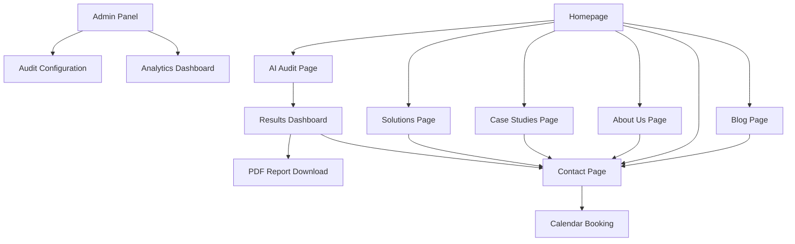

# XTeam.Pro AI-Powered Website - Product Requirements Document

## 1. Product Overview

XTeam.Pro is an AI-driven business automation platform that helps mid-to-large enterprises eliminate routine manual work, integrate disconnected systems, and implement multi-agent AI architectures to optimize operations across departments.

The website serves as the primary lead generation channel, providing immediate value through an AI-powered business process audit while showcasing solutions and convincing decision-makers to book consultations.

Target market value: Generate qualified leads from COO, CTO, CMO, and founders seeking 6-12 month ROI through scalable AI automation solutions.

## 2. Core Features

### 2.1 User Roles

| Role | Registration Method | Core Permissions |
|------|---------------------|------------------|
| Visitor | No registration required | Can access all public content, run AI audit |
| Lead | Email capture during audit | Receives PDF reports, newsletter access |
| Admin | Internal access only | Manage audit configurations, view analytics |

### 2.2 Feature Module

Our XTeam.Pro website consists of the following main pages:

1. **Homepage**: Hero section with AI audit CTA, company overview, case study previews, client trust logos, embedded audit widget
2. **AI Audit Page**: Conversational audit form, real-time analysis, results dashboard with radar chart, PDF report generation
3. **Solutions Page**: Industry-specific automation scenarios, agent examples, implementation methodologies
4. **Case Studies Page**: Success stories with metrics, ROI examples, client testimonials
5. **Pricing Page**: Service packages (Audit, Pilot, Implementation), interactive ROI calculator
6. **About Us Page**: Company mission, team profiles, methodology, partner ecosystem
7. **Contact Page**: Contact form, AI assistant bot, calendar booking integration
8. **Blog Page**: Industry insights, AI automation articles, thought leadership content
9. **Admin Panel**: Audit configuration, analytics dashboard, lead management

### 2.3 Page Details

| Page Name | Module Name | Feature description |
|-----------|-------------|---------------------|
| Homepage | Hero Section | Display compelling headline, AI audit CTA button, value proposition summary |
| Homepage | Case Study Previews | Show 3-4 success metrics cards with hover animations, link to full case studies |
| Homepage | Trust Indicators | Display client logos, partner badges, certifications in rotating carousel |
| Homepage | Audit Widget | Embed interactive audit preview with "Start Free Audit" trigger |
| AI Audit Page | Conversational Form | Multi-step form collecting industry, company size, pain points, current systems, KPIs |
| AI Audit Page | AI Analysis Engine | Process inputs via LLM, calculate maturity score (0-100), generate ROI forecast |
| AI Audit Page | Results Dashboard | Display radar chart, quick wins list, AI recommendations, download PDF option |
| AI Audit Page | Lead Capture | Collect email for PDF delivery, optional phone/company details |
| Solutions Page | Industry Scenarios | Present automation use cases by industry (sales, HR, logistics, support, finance) |
| Solutions Page | Agent Examples | Showcase specific agents: Email-to-CRM, SLA Monitor, Data Sync with technical details |
| Case Studies Page | Success Stories | Structured case studies with before/after metrics, implementation timeline |
| Case Studies Page | ROI Metrics | Highlight quantified results: revenue growth, cost reduction, efficiency gains |
| Pricing Page | Service Packages | Display tiered pricing: Audit ($0), Pilot ($X), Implementation (custom) |
| Pricing Page | ROI Calculator | Interactive calculator estimating savings based on company size and processes |
| About Us Page | Company Story | Mission statement, founding story, core values, methodology overview |
| About Us Page | Team Profiles | Key team members with expertise areas, LinkedIn integration |
| Contact Page | Contact Form | Multi-purpose form with inquiry type selection, file upload capability |
| Contact Page | AI Assistant | Chatbot for immediate responses, qualification questions, meeting scheduling |
| Contact Page | Calendar Integration | Embedded Calendly/similar for direct consultation booking |
| Blog Page | Article Listing | Paginated blog posts with categories, search, featured articles |
| Blog Page | Content Management | SEO-optimized articles with social sharing, related posts |
| Admin Panel | Audit Configuration | Manage audit questions, scoring algorithms, report templates |
| Admin Panel | Analytics Dashboard | Track audit completions, lead quality, conversion metrics |

## 3. Core Process

**Visitor Journey Flow:**
Visitors land on homepage → engage with hero CTA → complete AI audit → receive immediate results → download PDF report → book consultation → become qualified leads.

**AI Audit Process:**
User starts audit → answers conversational questions about business → AI analyzes responses → generates maturity score and ROI forecast → displays visual results → captures lead information → delivers PDF report → triggers CRM integration.

**Admin Management Flow:**
Admin accesses panel → reviews audit analytics → adjusts scoring parameters → manages lead pipeline → configures automation workflows → monitors conversion metrics.

## 4. User Interface Design

### 4.1 Design Style

- **Primary Colors**: Deep blue (#1e3a8a) for trust, electric blue (#3b82f6) for innovation
- **Secondary Colors**: White (#ffffff), light gray (#f8fafc), dark gray (#1f2937)
- **Button Style**: Rounded corners (8px), gradient backgrounds, hover animations with scale effects
- **Typography**: Inter font family, headings 32-48px, body text 16-18px, clean sans-serif
- **Layout Style**: Card-based design with subtle shadows, top navigation with sticky behavior
- **Icons**: Lucide React icons, AI/tech themed illustrations, animated micro-interactions

### 4.2 Page Design Overview

| Page Name | Module Name | UI Elements |
|-----------|-------------|-------------|
| Homepage | Hero Section | Full-width gradient background, centered content, animated CTA button, floating AI elements |
| Homepage | Case Studies | Grid layout with metric cards, hover effects revealing details, progress bars for metrics |
| AI Audit Page | Conversational Form | Step-by-step wizard interface, progress indicator, conversational bubbles, smooth transitions |
| AI Audit Page | Results Dashboard | Radar chart visualization, metric cards, color-coded scores, download button prominence |
| Solutions Page | Industry Scenarios | Tabbed interface, icon-based navigation, expandable content sections |
| Case Studies Page | Success Stories | Timeline layout, before/after comparisons, testimonial quotes, metric highlights |
| Pricing Page | Service Packages | Three-column layout, highlighted recommended plan, feature comparison table |
| Contact Page | Contact Form | Clean form design, real-time validation, success animations |
| Admin Panel | Dashboard | Data visualization charts, KPI widgets, responsive grid layout |

### 4.3 Responsiveness

Desktop-first approach with mobile-adaptive breakpoints at 768px and 1024px. Touch interaction optimization for mobile audit flow, swipe gestures for case study navigation, and optimized form inputs for mobile completion rates.