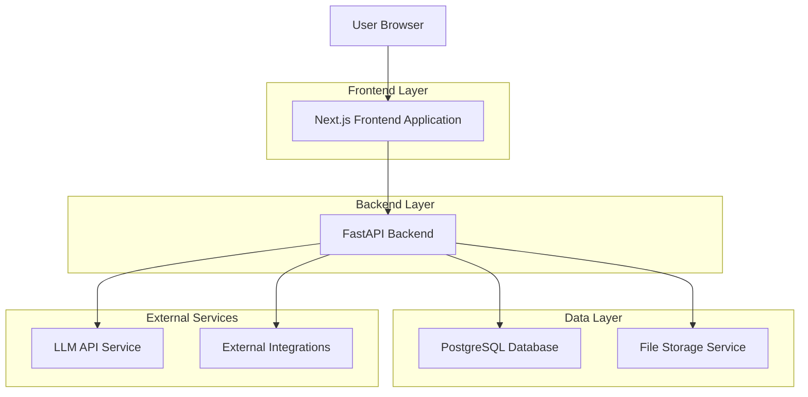
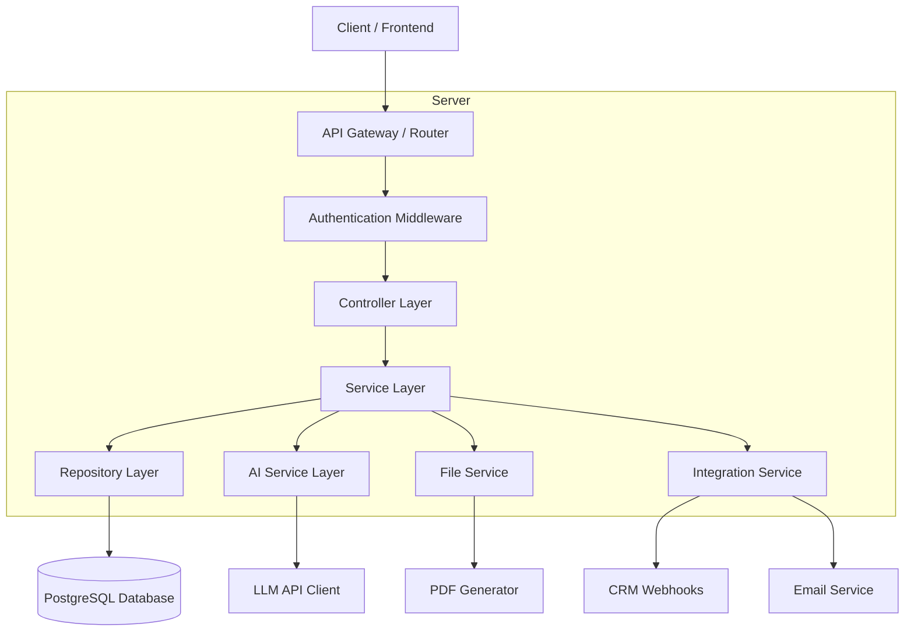

# XTeam.Pro AI-Powered Website - Technical Architecture Document

## 1. Architecture Design



## 2. Technology Description

* Frontend: Next.js\@14 + React\@18 + TypeScript + Tailwind CSS\@3 + shadcn/ui + Framer Motion + Lucide React

* Backend: FastAPI + Python\@3.11 + SQLAlchemy + Alembic

* Database: PostgreSQL\@15

* AI Integration: OpenAI GPT API + LangChain

* File Storage: Local file system (development) / AWS S3 (production)

* PDF Generation: ReportLab + Matplotlib

* Deployment: Vercel (frontend) + Docker (backend)

## 3. Route Definitions

| Route                | Purpose                                     |
| -------------------- | ------------------------------------------- |
| /                    | Homepage with hero section and audit CTA    |
| /audit               | AI-powered business process audit interface |
| /audit/results/\[id] | Display audit results and PDF download      |
| /solutions           | Industry-specific automation scenarios      |
| /case-studies        | Success stories and client testimonials     |
| /pricing             | Service packages and ROI calculator         |
| /about               | Company information and team profiles       |
| /contact             | Contact form and consultation booking       |
| /blog                | Articles and thought leadership content     |
| /blog/\[slug]        | Individual blog post pages                  |
| /admin               | Admin panel for audit configuration         |
| /admin/analytics     | Analytics dashboard and lead management     |

## 4. API Definitions

### 4.1 Core API

**AI Audit Submission**

```
POST /api/audit/submit
```

Request:

| Param Name     | Param Type | isRequired | Description                      |
| -------------- | ---------- | ---------- | -------------------------------- |
| industry       | string     | true       | Business industry category       |
| companySize    | string     | true       | Employee count range             |
| painPoints     | array      | true       | List of business challenges      |
| currentSystems | array      | true       | Existing software/tools          |
| kpis           | array      | true       | Key performance indicators       |
| contactInfo    | object     | true       | Email and optional phone/company |

Response:

| Param Name      | Param Type | Description                          |
| --------------- | ---------- | ------------------------------------ |
| auditId         | string     | Unique audit identifier              |
| maturityScore   | number     | Business maturity score (0-100)      |
| roiForecast     | object     | Projected ROI metrics                |
| recommendations | array      | AI-generated improvement suggestions |
| reportUrl       | string     | PDF report download link             |

Example Request:

```json
{
  "industry": "manufacturing",
  "companySize": "100-500",
  "painPoints": ["manual data entry", "disconnected systems"],
  "currentSystems": ["SAP ERP", "Salesforce CRM"],
  "kpis": ["revenue growth", "operational efficiency"],
  "contactInfo": {
    "email": "cto@company.com",
    "phone": "+1234567890",
    "company": "TechCorp Inc"
  }
}
```

**Get Audit Results**

```
GET /api/audit/results/{audit_id}
```

Response:

| Param Name | Param Type | Description                        |
| ---------- | ---------- | ---------------------------------- |
| auditData  | object     | Complete audit information         |
| analysis   | object     | AI analysis results                |
| visualData | object     | Chart data for radar visualization |
| pdfUrl     | string     | Generated PDF report URL           |

**Contact Form Submission**

```
POST /api/contact/submit
```

Request:

| Param Name  | Param Type | isRequired | Description           |
| ----------- | ---------- | ---------- | --------------------- |
| name        | string     | true       | Contact person name   |
| email       | string     | true       | Contact email address |
| company     | string     | false      | Company name          |
| message     | string     | true       | Inquiry message       |
| inquiryType | string     | true       | Type of inquiry       |

**ROI Calculator**

```
POST /api/calculator/roi
```

Request:

| Param Name | Param Type | isRequired | Description                  |
| ---------- | ---------- | ---------- | ---------------------------- |
| employees  | number     | true       | Number of employees          |
| processes  | array      | true       | Manual processes to automate |
| timeSpent  | object     | true       | Hours spent on manual tasks  |

Response:

| Param Name         | Param Type | Description                       |
| ------------------ | ---------- | --------------------------------- |
| potentialSavings   | number     | Annual cost savings estimate      |
| implementationCost | number     | Estimated implementation cost     |
| paybackPeriod      | number     | ROI payback period in months      |
| efficiency         | number     | Efficiency improvement percentage |

## 5. Server Architecture Diagram



## 6. Data Model

### 6.1 Data Model Definition

```mermaid
erDiagram
    AUDIT ||--o{ AUDIT_RESPONSE : contains
    AUDIT ||--|| AUDIT_RESULT : generates
    AUDIT_RESULT ||--|| PDF_REPORT : creates
    CONTACT_INQUIRY ||--o{ FOLLOW_UP : triggers
    BLOG_POST ||--o{ BLOG_CATEGORY : belongs_to
    ADMIN_USER ||--o{ AUDIT_CONFIG : manages

    AUDIT {
        uuid id PK
        string industry
        string company_size
        json pain_points
        json current_systems
        json kpis
        json contact_info
        timestamp created_at
        string status
    }
    
    AUDIT_RESPONSE {
        uuid id PK
        uuid audit_id FK
        string question
        string answer
        int step_number
        timestamp created_at
    }
    
    AUDIT_RESULT {
        uuid id PK
        uuid audit_id FK
        int maturity_score
        json roi_forecast
        json recommendations
        json visual_data
        timestamp generated_at
    }
    
    PDF_REPORT {
        uuid id PK
        uuid audit_result_id FK
        string file_path
        string download_url
        timestamp created_at
        boolean is_downloaded
    }
    
    CONTACT_INQUIRY {
        uuid id PK
        string name
        string email
        string company
        string inquiry_type
        text message
        string status
        timestamp created_at
    }
    
    FOLLOW_UP {
        uuid id PK
        uuid inquiry_id FK
        string action_type
        text notes
        timestamp scheduled_at
        timestamp completed_at
    }
    
    BLOG_POST {
        uuid id PK
        string title
        string slug
        text content
        string author
        boolean published
        timestamp created_at
        timestamp updated_at
    }
    
    BLOG_CATEGORY {
        uui
```

